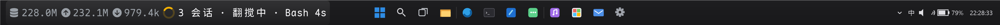
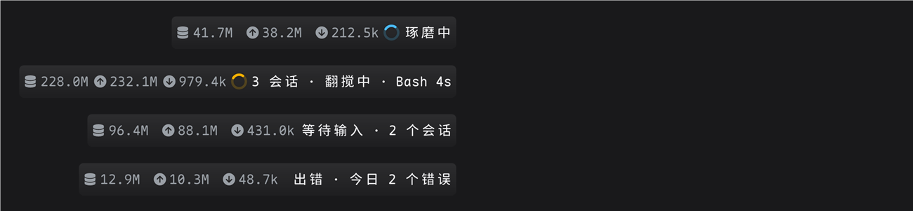
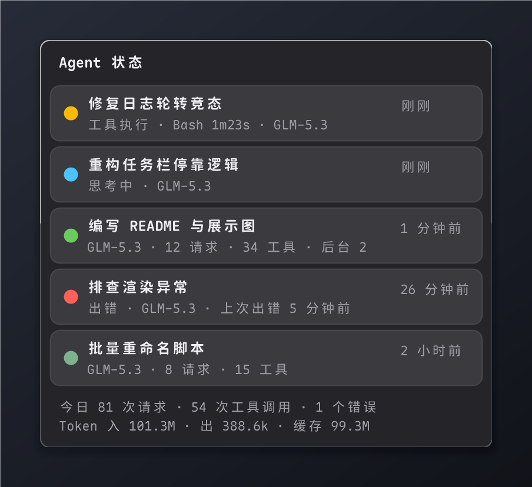
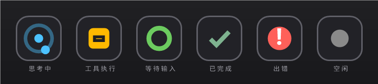

# AgentStatusBar

**Windows 11 任务栏上的 AI Agent 运行状态指示器。** 驻留托盘，盯着一组日志文件，把 Agent 会话的实时状态画在任务栏最左侧：在思考、在执行工具、在等你输入还是出了错，扫一眼就知道——不用切回终端。第一版支持 [ZCode](https://github.com/z-ai/zcode)，数据全部来自本机日志，不上传任何内容。

<p align="center">
  
</p>

## 它长什么样

### 任务栏状态条

停靠在任务栏左侧空隙（自动避让播放器歌词等贴任务栏的控件），与任务栏同高的液态玻璃胶囊。从左到右：

`今日 token 用量（缓存 / 入 / 出）` → `旋转圆环（运行中才出现）` → `会话数` → `俏皮话` → `当前工具 · 耗时`

- 俏皮话每 4 秒轮换（187 条动词，移植自 [claude-code-zh-cn](https://github.com/taekchef/claude-code-zh-cn)），切换时 260ms 交叉淡入滑动
- 空闲时整条自动隐藏，有活动自动回来；全屏应用（F11 / 截图遮罩 / 远程桌面）时即时隐藏
- 3 倍超采样渲染再高质量缩小，小字号也清晰无锯齿
- 左键弹出详情面板，右键弹出菜单

<p align="center">
  
</p>

### 详情面板

左键状态条（或托盘图标）弹出。按会话列出标题、相位、模型、轮次 / 请求 / 工具 / 错误统计，子智能体并入主会话（`SubAgent×N · 类型`）；底部是今日汇总。原地刷新不重建控件、位置零漂移，Esc 或点击外部关闭。

<p align="center">
  
</p>

### 托盘图标

彩色状态点 + 思考中旋转动画，鼠标悬停可看总体状态 / 会话数 / 当前工具 / 模型。

<p align="center">
  
</p>

| 图标 | 相位 | 含义 |
| --- | --- | --- |
| 🔵 | 思考中 | 模型生成中 |
| 🟠 | 工具执行 | 悬停可看当前工具名与耗时 |
| 🟢 | 等待输入 | 挂着提问 / 计划审批，等你操作 |
| ✔️ | 已完成 | 灰绿色，干完活了 |
| 🔴 | 出错 | 悬停可看错误数 |
| ⚪ | 空闲 | 无进行中会话（任务栏状态条隐藏） |

## 工作原理

```
ZCode 日志 (~/.zcode/cli/log/zcode-YYYY-MM-DD.jsonl，实时追加)
  │  FileSystemWatcher 事件驱动 + 250ms 防抖，增量 tail 只读新增字节
  ▼
事件流解析  turn.started/completed/failed · tool.call.* · model.request.*
            session.model.updated · background_task.tracking.* …
  ▼
按 sessionId 聚合成每个会话的状态机（相位、当前工具、统计、等待输入判定）
  ▼
汇总为总体状态 → 任务栏状态条 / 托盘图标 / 详情面板
```

配套数据：

- **会话标题**：ZCode SQLite 库，经 node 只读查询、45 秒缓存；无 node 时回退项目目录名 / 短 ID
- **token 用量**：SQLite `model_usage` 表聚合（缓存 / 入 / 出），45 秒刷新
- 事件停滞 >90s 自动降级（轮次未结束判等待输入，已结束判空闲），防止 ZCode 异常退出后状态卡死

## 性能设计

- 事件驱动 + 增量 tail：记录文件偏移，处理半行缓存与跨天滚动；启动只回看末尾 256KB 做种子，不全量解析
- 图标仅在状态变化（或运行动画帧）时重绘；面板 / 迷你条不可见时不刷新
- 零依赖单文件 exe 约 50KB，用 .NET Framework 自带运行时，常驻内存 ~35–60MB

## 构建与运行

无需安装任何 SDK，Windows 自带的 .NET Framework 编译器即可：

```cmd
build.cmd
```

```cmd
AgentStatusBar.exe            :: 常驻托盘
AgentStatusBar.exe --status   :: 控制台输出一次解析结果（调试用，也写入 status-dump.txt）
```

- 配置保存在 `%APPDATA%\AgentStatusBar\config.ini`（迷你条开关与位置）
- 开机自启：托盘右键菜单开关（写入 HKCU Run）；单实例互斥；未捕获异常写入 error.log
- 字体：优先使用 [Maple Mono NF CN](https://github.com/subframe7536/maple-font)（中英等宽 + Nerd Font 图标），缺失时回退苹方 / Noto Sans SC / 微软雅黑

重新生成 README 展示图（伪造数据离屏渲染，同样无需 SDK）：

```cmd
docs\render-assets.cmd
```

## 已知限制

状态判定：

- 「等待输入」只显示**挂着提问 / 审批**的会话（AskUserQuestion / 计划审批期间、开放轮次静默 >90s）。单纯开着的会话不展示——ZCode 日志没有"会话关闭"事件，静默无法区分"在等用户"与"已关终端"，只有挂起提问有明确标记
- 统计口径为"启动回看窗口 + 本次运行增量"，重启后今日计数从种子窗口重新累积；`turn.started` 若发生在种子窗口之前，轮次数会偏小
- 会话面板显示最近 12 小时内活跃、且**运行中或挂着提问 / 审批**的（最多 8 个）；其余在后台跟踪，再次 `turn.started` 会重新出现
- 修改系统时间会导致静默降级误判

任务栏状态条：

- 仅支持横向任务栏（Win11 默认）；任务栏图标左对齐时无空隙，状态条自动隐藏；竖向任务栏不支持
- 分辨率 / 缩放变化后最多 0.5 秒内跟上

## 路线图

- [ ] 支持更多 Agent（Claude Code、Codex 等，同样基于日志文件探测）
- [ ] 设置界面（活跃阈值、展示项、状态条位置微调）
- [ ] 如需极致轻量（<10MB 内存）可迁移 Rust + 纯 Win32

## 代码结构

```
src/
  Program.cs        入口：单实例、DPI、异常日志、--status 调试模式
  StatusEngine.cs   核心：日志 tail + 事件解析 + 会话状态机（无 UI 依赖，可独立复用）
  TaskbarStrip.cs   任务栏状态条：Shell_TrayWnd 空隙探测 + 分层窗口渲染（UpdateLayeredWindow）
  TrayApp.cs        托盘图标绘制、提示、右键菜单、自启动、装配
  PopupForm.cs      详情面板
  StateDot.cs       状态圆点控件
  Phrases.cs        187 条俏皮话（由 verbs.json 生成）
  Ui.cs             颜色/字体/时间格式化
  Native.cs         DWM、DPI、任务栏/分层窗口等 P/Invoke
  Settings.cs       极简 INI 配置
docs/
  render-assets.cs  README 展示图渲染器（复用 src 的配色与布局常量，伪造数据）
  render-assets.cmd 编译并运行上面的渲染器
  img/              生成的展示图
shot.ps1            开发用：截取任务栏区域
tbdiag.ps1          开发用：枚举任务栏子窗口与本程序窗口矩形
```
